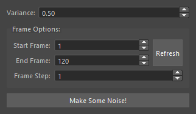

| Screenshot | Description |
|-|-|
|  | **NoisyBoy** is an [AutoDesk Maya 2016+](https://www.autodesk.com/products/maya/overview) utility to generate random noise for selected object(s) channels.

## Installation:

**01** [Download NoisyBoy](https://github.com/braschko/noisyBoy/releases/download/1.0/noisyBoy_1.0.zip)

**02** Unpack to your desired scripts directory:

|Operating System | Location |
|-|-|
| Windows | C:/Users/\<username\>/Documents/maya/scripts |
| Windows | C:/Users/\<username\>/Documents/maya/\<version\>/scripts |
| Linux | $HOME/maya/scripts |
| Linux | $HOME/maya/\<version\>/scripts |
| OSX | $HOME/Library/Preferences/Autodesk/maya/scripts |
| OSX | $HOME/Library/Preferences/Autodesk/maya/\<version\>/scripts |

**03** Drop **install_NoisyBoy.py** onto a running Maya window which will then ask:

> The NoisyBoy Installer will now create a shelf button under the "Custom" tab, is that ok?

**04** Click **Yes** and new shelf button will appear.

```Python

# If you do not wish to use install_NoisyBoy.py simply delete it.
# The shelf button's contents is the following PYTHON code.

from noisyBoy import NoisyBoy

# Show the NoisyBoy interface
NoisyBoy.show()
```

## Dev Quick Notes:

```python
from noisyBoy import NoisyBoy

# Show the NoisyBoy interface
NoisyBoy.show()

# -- OR: Use Non Interface Functions -- #

NoisyBoy.addNoise(startFrame, endFrame, frameStep = 1, unitVariance = 0.5):
"""
Add noise to the selected object(s) channels.

Parameters:
  - startFrame   int  : Start frame range
  - endFrame     int  : End frame range
  - frameSetp    int  : How many frames to move by for the given frame range
  - unitVariance float: How much change for the current attribute value >= 0

Returns:
  bool: If noise is added
"""
```
